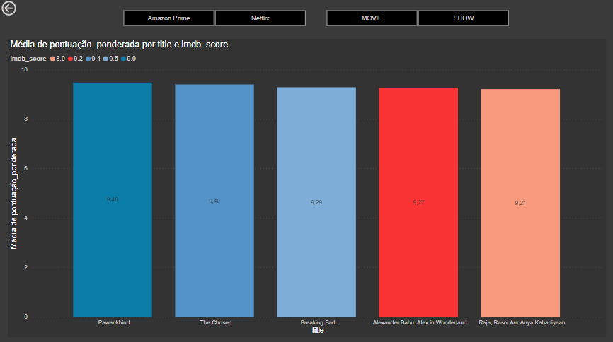
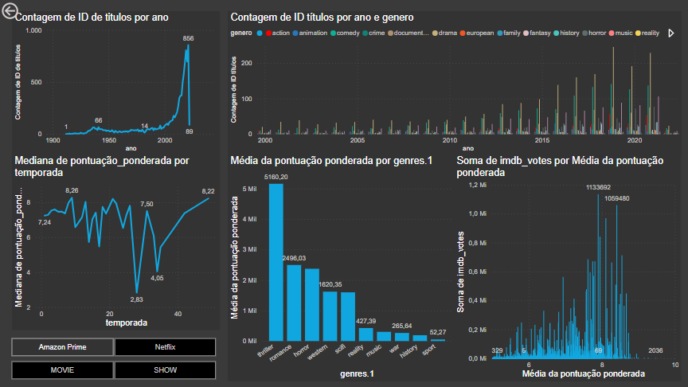
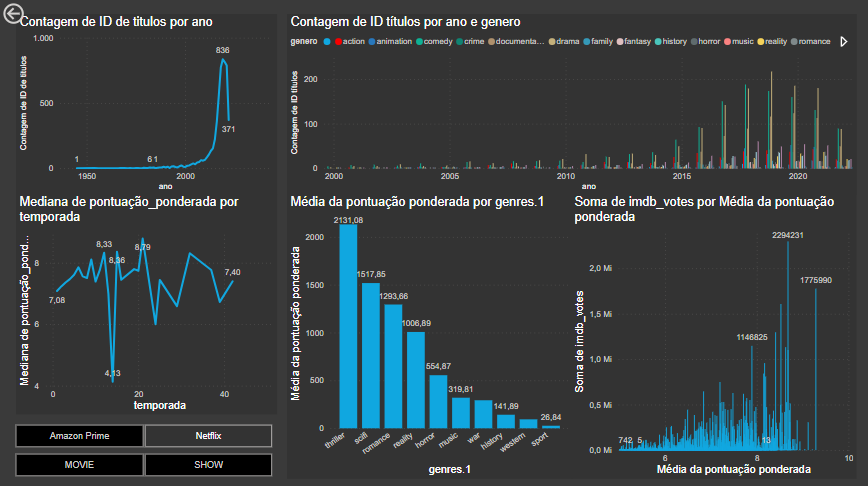
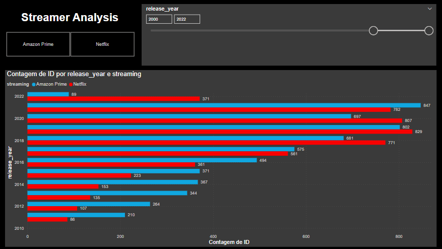
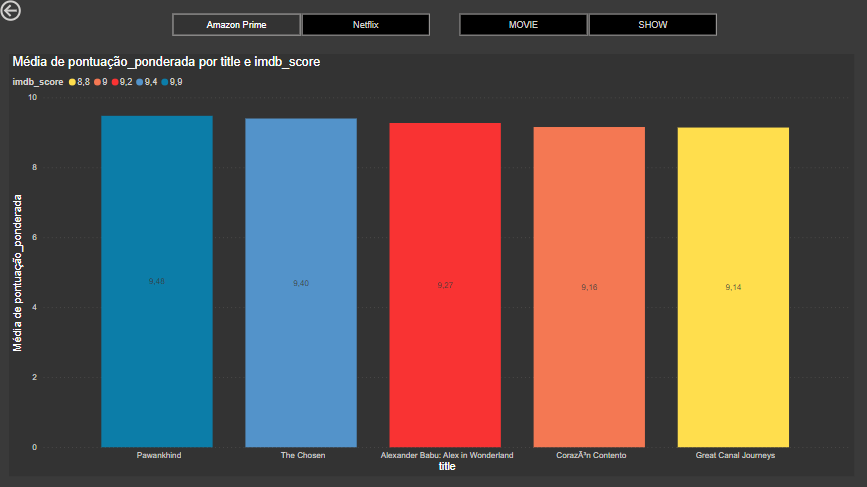

# Visualização de Dados com Power BI

Dashboard desenvolvido com base em dois datasets a fim de visualizar e analisar o comportamento das plataformas de streaming Netflix e Prime Video ao longo do tempo. Para esse projeto, foi necessário utilizar Python para fazer a união, a limpeza e o preparo inicial dos conjuntos de dados. Já no Power BI, ferramentas nativas foram utilizadas para complementar o tratamento das informações antes da construção da visualização.
 
As bases de dados estão disponíveis no Kaggle ([Netflix](https://www.kaggle.com/datasets/victorsoeiro/netflix-tv-shows-and-movies?select=titles.csv) e [Prime Video](https://www.kaggle.com/datasets/victorsoeiro/amazon-prime-tv-shows-and-movies?select=titles.csv)) e o procedimento de limpeza realizado com Python está disponível [aqui](https://github.com/JhenyfferOliveira/Projeto-PowerBI-Ada/blob/main/dataset.ipynb).

O projeto foi realizado em março de 2024 e visou cumprir os requisitos de **Visualização com Power BI**, do bootcamp de Ciência de Dados da **Ada Tech**, patrocinado pelo **Potência Tech**, do **iFood**. 

Integrantes:
* Carlos André
* Jhenyffer Oliveira
* Rodrigo Udenal
* Wallace Souza

---

# Análise Geral
### Dashboard Completo

### Amazon Prime

### Netflix

---

# Perguntas e Tendências Gerais

Assim, a análise de tendências gerais com base nos gráficos ficou evidente e chegou-se a alguns questionamentos. Seguem abaixo

## **1. Qual é a distribuição de filmes e séries por tipo (filme ou série de TV) nas plataformas?**
### Amazon Prime

+ Prime Video: 8416 Filmes e 1355 Séries
+ Porcentagem: 86% Filmes e 14% Séries

### Netflix

+ Netflix: 3725 Filmes e 2096 Séries
+ Porcentagem: 70% Filmes e 30% Séries

## **2. Como a quantidade de conteúdo lançado tem variado ao longo dos anos?**

+ Prime Video: Em 2016, expansão global 200+ países
+ Netflix: Expansão Global 130+ países
+ 2019: ano em que se fechou a última blockbuster nos Estados Unidos
+ O pico de produções das plataformas de streaming coincide com as expansões de mercado globais e o fim da cultura de blockbuster

## **3. Quais são os gêneros mais populares em cada plataforma?**

Top 5:
+ Amazon: Drama, Thriller, Comédia, Sci-fi, Romance.
+ Netflix: Drama, Thriller, Comédia, Ação, Crime.

## **4. Qual é a distribuição geográfica das produções (países de origem) em cada plataforma?**

+ Produções majoritariamente feitas em dois países: US and IN.

## **5. Como a popularidade (avaliações do IMDb e pontuações do TMDb) varia entre os diferentes tipos de conteúdo (filmes versus séries de TV)?**

+ Amazon Prime: 1357 Avaliações Séries e 8514 Filmes
+ Netflix: 2106 Avaliações Séries e 3744 Filmes

## **6. Existe alguma correlação entre a popularidade do conteúdo (avaliações do IMDb, pontuações do TMDb e popularidade do TMDb) e o número de temporadas para séries de TV?**

+ Nota-se que a partir de 20 temporadas, no geral, as séries tendem a perder popularidade. Ou seja, seriados com poucas temporadas são melhor avaliados e costumam manter a popularidade e ter uma distribuição normal. 

## **7. Quais são os títulos mais populares em cada plataforma, com base em uma combinação de pontuações, popularidade e número de votos**

#### **Cálculo da média ponderada pela técnica da ponderação dos votos:**

> Pontuação ponderada = (*imdb_score* * (1 - 1 / (1 + *imdb_votes*)) * 0.7) + (*tmdb_score* * 0.3)

Essa fórmula penaliza os títulos com mais votos, pois a divisão por um número maior de votos resultará em uma fração menor, reduzindo o impacto da pontuação original. Isso pode ser útil para garantir que títulos com um grande número de votos tenham suas pontuações mais representativas, refletindo uma média mais precisa das avaliações dos usuários.

*imdb_score* com ponderação dos votos: Tem um peso de 0.7. Isso sugere que a pontuação do IMDb é considerada relativamente mais importante do que as outras métricas na determinação da popularidade do título. A pontuação do IMDb geralmente é considerada uma métrica importante, pois reflete a avaliação geral do título pelos usuários.

*imdb_votes*: Com peso 0.3, fornece uma medida relevante da popularidade, complementando o IMDb. Isso garante uma avaliação equilibrada, considerando opiniões de ambos os usuários do IMDb e TMDB.

*tmdb_sc*: Tem um peso de 0.3. Isso sugere que a pontuação do TMDb é considerada a menos importante das duas métricas na determinação da popularidade do título. No entanto, ainda é incluída na fórmula porque pode fornecer uma perspectiva adicional sobre a popularidade do título.

## **8. Existe alguma relação entre a popularidade do conteúdo e o número de votos no IMDb?**

+ Os títulos mais votados são os que tendem a ter uma distribuição mais próxima de uma distribuição normal.

---

# Observações:
+ Os conjuntos de dados foram criados para listar todos os programas disponíveis nas plataformas, em junho de 2022, com informações disponíveis nos Estados Unidos.

---

# Ferramentas utilizadas

| Python | Pandas | Power BI | Git | 
| ------ | ------ | -------- | --- | 
|  |  |  |  |
