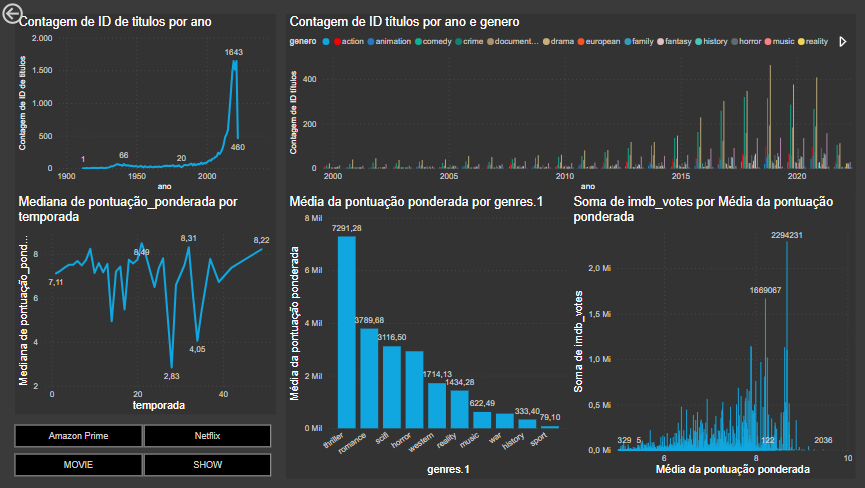

# Visualização de Dados com Power BI

Dashboard desenvolvido com base em dois datasets a fim de visualizar e analisar o comportamento das plataformas de streaming Netflix e Prime Video ao longo do tempo. Para esse projeto, foi necessário utilizar Python para fazer a união, a limpeza e o preparo inicial dos conjuntos de dados. Já no Power BI, ferramentas nativas foram utilizadas para complementar o tratamento das informações antes da construção da visualização.
 
As bases de dados estão disponíveis no Kaggle ([Netflix](https://www.kaggle.com/datasets/victorsoeiro/netflix-tv-shows-and-movies?select=titles.csv) e [Prime Video](https://www.kaggle.com/datasets/victorsoeiro/amazon-prime-tv-shows-and-movies?select=titles.csv)) e o procedimento de limpeza realizado com Python está disponível [aqui](https://github.com/JhenyfferOliveira/Projeto-PowerBI-Ada/blob/main/dataset.ipynb).

O projeto visou cumprir os requisitos de **Visualização com Power BI**, do bootcamp de Ciência de Dados da **Ada Tech**, patrocinado pelo **Potência Tech**, do **iFood**. 

O projeto foi realizado em março de 2024 e contou com a colaboração de 4 integrantes:
* Carlos André
* Jhenyffer Oliveira
* Rodrigo Udenal
* Wallace Souza

---

# Análise Geral
### Amazon Prime e Netflix 

### Amazon Prime

### Netflix

---

# Perguntas Iniciais e Tendências Gerais

Assim, a análise de tendências gerais com base nos gráficos ficou evidente e chegou-se a alguns questionamentos. Seguem abaixo

## **1. Qual é a distribuição de filmes e séries por tipo (filme ou série de TV) nas plataformas?**

+ Prime Video: 8416 Filmes e 1355 Séries
+ Porcentagem: 86% Filmes e 14% Séries
+ Netflix: 3725 Filmes e 2096 Séries
+ Porcentagem: 70% Filmes e 30% Séries

## **2. Como a quantidade de conteúdo lançado tem variado ao longo dos anos?**

Prime vídeo: Em 2016, expansão global 200+ países
Netflix: Expansão Global 130+ países
2019: ano em que se fechou a última blockbuster, última nos Estados Unidos.
O pico de produções das plataformas de streaming coincide com as expansões de mercado globais e o fim da cultura de blockbuster.

## **3. Quais são os gêneros mais populares em cada plataforma?**

Top 5:
+ Amazon: Drama, Thriller, Comédia, Sci-fi, Romance.
+ Netflix: Drama, Thriller, Comédia, Ação, Crime.

## **4. Qual é a distribuição geográfica das produções (países de origem) em cada plataforma?**

+ Produções majoritariamente feitas em dois países: US and IN.

## **5. Como a popularidade (avaliações do IMDb e pontuações do TMDb) varia entre os diferentes tipos de conteúdo (filmes versus séries de TV)?**

## **6. Existe alguma correlação entre a popularidade do conteúdo (avaliações do IMDb, pontuações do TMDb e popularidade do TMDb) e o número de temporadas para séries de TV?**

## **7. Existe alguma relação entre a popularidade do conteúdo e o número de votos no IMDb?**

## **8. Quais são os títulos mais populares em cada plataforma, com base em uma combinação de pontuações, popularidade e número de votos?**

## **9. Como a popularidade do conteúdo varia entre diferentes países?**

---

# Considerações Finais

---

# Observações:
+ Os conjuntos de dados foram criados para listar todos os programas disponíveis nas plataformas, em junho de 2022, com informações disponíveis nos Estados Unidos.

---

# Ferramentas utilizadas

| Python | Pandas | Power BI | Git | 
| ------ | ------ | -------- | --- | 
|  |  |  |  |
